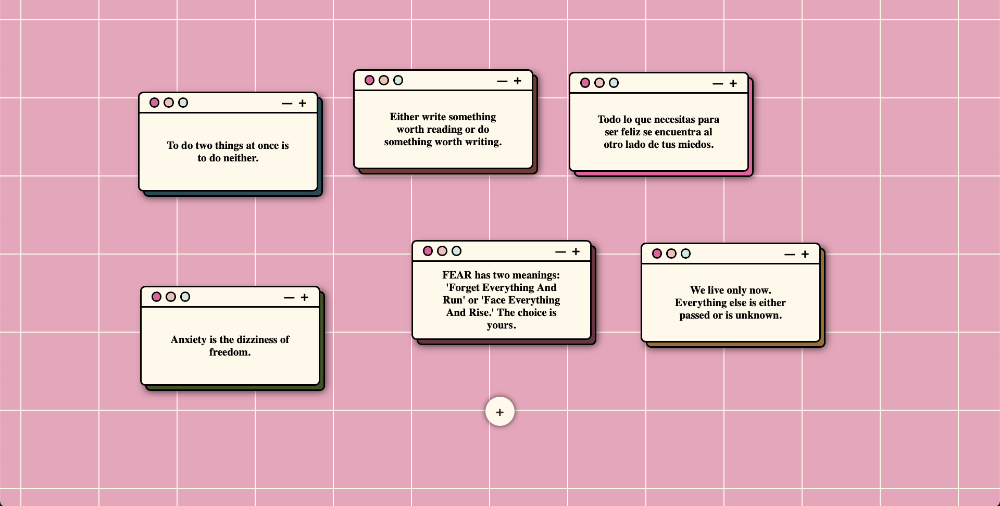

# ✨ ZenQuotes Fetcher

Una mini aplicación hecha con **HTML, CSS y JavaScript puro** (Vanilla JS) que muestra frases motivacionales obtenidas desde la API de [ZenQuotes.io](https://zenquotes.io). Utiliza el proxy público `AllOrigins` para evitar problemas de CORS, y está 100% libre de dependencias externas.

---

## 🔗 Demo en vivo

👉 [Ver en GitHub Pages](https://adriancafe.github.io/zenquotes-vanilla/)

---

## 📷 Captura



---

## 🚀 Características

- Interfaz simple y responsiva
- Frases motivacionales aleatorias con autor
- 100% Vanilla JS, sin frameworks ni librerías externas
- Consulta externa a API usando proxy con CORS habilitado

---

## 🛠️ Instalación local

Puedes clonarlo y correrlo en tu máquina local con cualquier navegador moderno.

### 1. Clonar el repositorio

```bash
git clone https://github.com/adriancafe/zenquotes-vanilla.git
cd zenquotes-vanilla
